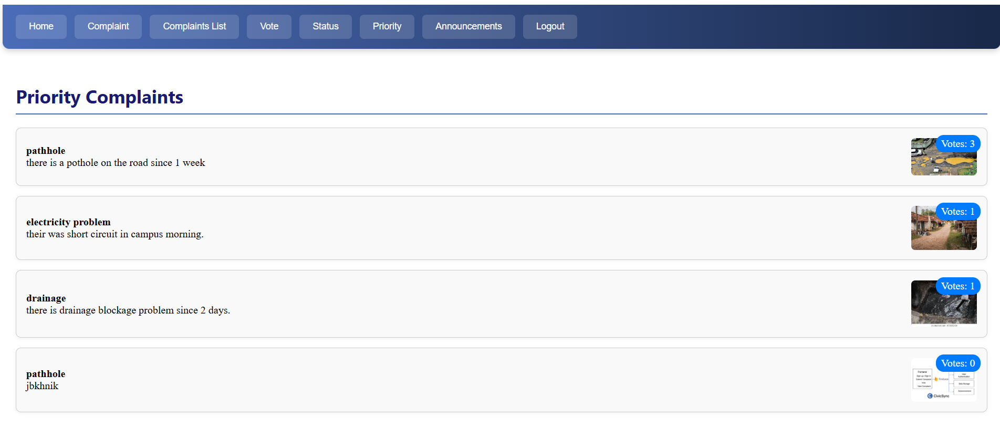
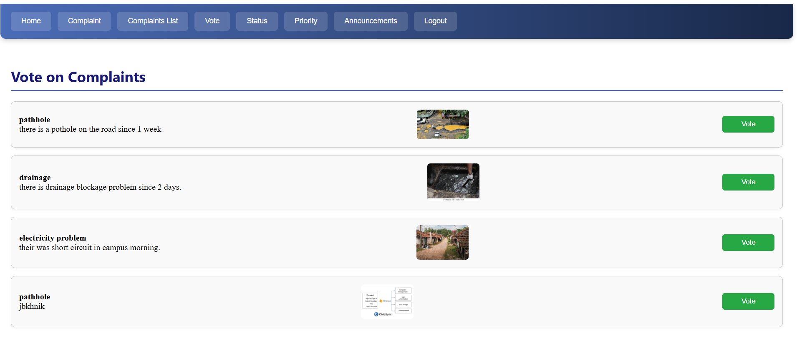
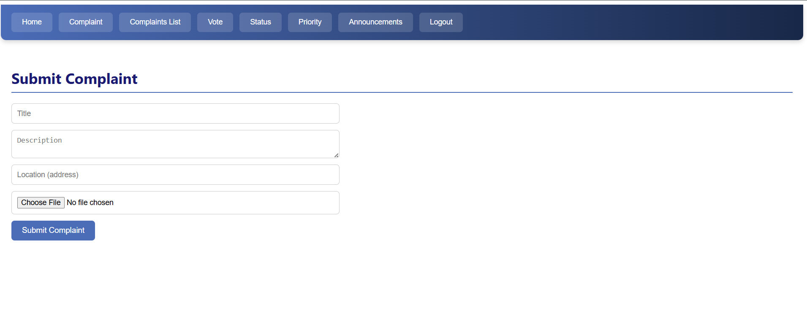

# CivicSync  

CivicSync is a citizen–government bridge for reporting and tracking civic issues like road damage, water leakage, or broken streetlights.  
Built using **HTML, CSS, JavaScript, and Firebase** for authentication and data management.  

## Features
- User authentication (Signup, Signin)  
- Submit complaints with image upload  
- View, vote, and prioritize complaints  
- Real-time status updates  
- Admin dashboard for announcements  

## Tech Stack
- Frontend: HTML, CSS, JavaScript  
- Backend & Database: Firebase Firestore  
- Hosting (optional): Firebase Hosting or GitHub Pages  

## Future Enhancements
- Add admin analytics panel  
- Cloud image storage (Cloudinary / Firebase Storage)  
- Improved mobile responsiveness  

## Screenshots
*(Add screenshots of your web app UI here)*  

## 👤 Developer
ADITYA DESAI  
[linkedin.com/in/aditya-desai-32114925a] • [desaiaditya940@gmail.com]
